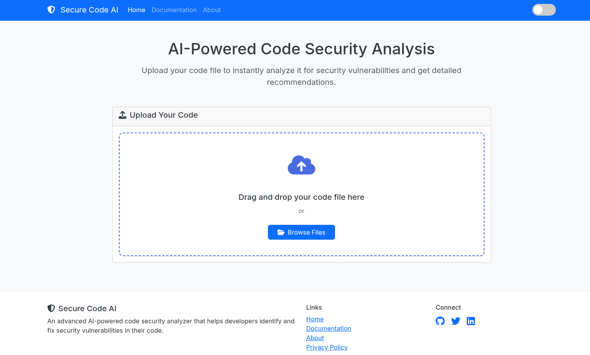
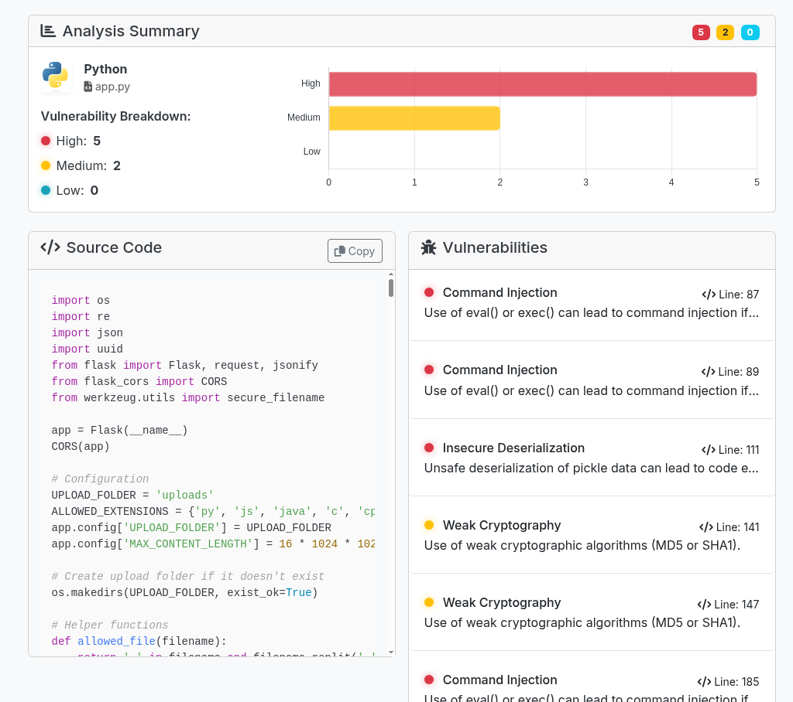

# Secure Code AI





Secure Code AI is an advanced AI-powered code security analyzer that helps developers identify and fix security vulnerabilities in their code. The tool provides detailed analysis, recommendations, and visual reporting to improve code security.

## Features

- **Multi-language Support**: Analyze code in Python, JavaScript, Java, C, C++, PHP, Ruby, and Go
- **Detailed Vulnerability Analysis**: Identifies common security issues such as:
  - SQL Injection
  - Cross-Site Scripting (XSS)
  - Command Injection
  - Buffer Overflows
  - Insecure Deserialization
  - Hardcoded Secrets
  - And more...
- **Severity Classification**: Vulnerabilities are categorized as High, Medium, or Low severity
- **Visual Reporting**: Interactive charts and highlighted code sections for easy understanding
- **Line-specific Feedback**: Identifies the exact line where vulnerabilities occur
- **Detailed Recommendations**: Provides actionable advice to fix each vulnerability
- **Code Highlighting**: Syntax highlighting for better code readability
- **Dark/Light Theme Support**: Customizable UI for different preferences

## Technologies Used

### Frontend
- HTML5, CSS3, JavaScript
- Bootstrap 5
- Chart.js for data visualization
- Highlight.js for code syntax highlighting
- Font Awesome for icons

### Backend
- Python
- Flask web framework
- Regular expressions for code analysis

## Installation

### Prerequisites
- Python 3.6 or higher
- Node.js and npm (optional, for development)

### Setup

1. Clone the repository
```bash
git clone https://github.com/Kishan-Patel-dev/AI-Code-Security-Analyzer.git
cd AI-Code-Security-Analyzer
```

2. Set up the backend
```bash
cd backend
pip install -r requirements.txt  # You'll need to create this file with Flask and Flask-CORS
```

3. Start the backend server
```bash
python app.py
```

4. Open the frontend
```bash
cd ../frontend
# You can use any static file server to serve the frontend files
# For example, with Python:
python -m http.server 8000
```

5. Open your browser and navigate to `http://localhost:8000`

## Usage

1. Visit the application in your web browser
2. Drag and drop your code file or use the "Browse Files" button
3. Wait for the analysis to complete
4. Review the identified vulnerabilities with their severity levels
5. Click on any vulnerability to see detailed information, including:
   - Description of the vulnerability
   - The affected code snippet
   - Potential impact
   - Recommended fix
   - Reference links for further reading
6. Use the highlighted source code view to locate the exact location of issues

## Supported Languages

- Python (`.py`)
- JavaScript (`.js`)
- Java (`.java`)
- C (`.c`)
- C++ (`.cpp`)
- PHP (`.php`)
- Ruby (`.rb`)
- Go (`.go`)

## Project Structure

```
secure-code-ai/
├── backend/
│   └── app.py           # Flask backend server and vulnerability analyzers
├── frontend/
│   ├── index.html       # Main HTML file
│   ├── style.css        # CSS styles with light/dark theme support
│   └── script.js        # Frontend JavaScript for UI interaction
└── uploads/             # Directory for uploaded code files (auto-created)
```

## Screenshots

[Add screenshots of the application here]

## Contributing

Contributions are welcome! Please feel free to submit a Pull Request.

1. Fork the repository
2. Create your feature branch (`git checkout -b feature/amazing-feature`)
3. Commit your changes (`git commit -m 'Add some amazing feature'`)
4. Push to the branch (`git push origin feature/amazing-feature`)
5. Open a Pull Request

### Extending Support for New Languages

To add support for a new programming language:
1. Add a new analyzer function in `app.py`
2. Update the `ALLOWED_EXTENSIONS` and `language_map` in `app.py`
3. Add appropriate vulnerability detection patterns

## License

This project is licensed under the MIT License - see the LICENSE file for details.

## Author

Developed by Kishan Patel

- GitHub: [Kishan-Patel-dev](https://github.com/Kishan-Patel-dev/)
- Twitter: [KishanPatel_dev](https://x.com/KishanPatel_dev)
- LinkedIn: [kishan-patel-dev](https://www.linkedin.com/in/kishan-patel-dev/)

## Acknowledgements

- [OWASP](https://owasp.org/) for security vulnerability information
- [Bootstrap](https://getbootstrap.com/)
- [Chart.js](https://www.chartjs.org/)
- [Highlight.js](https://highlightjs.org/)
